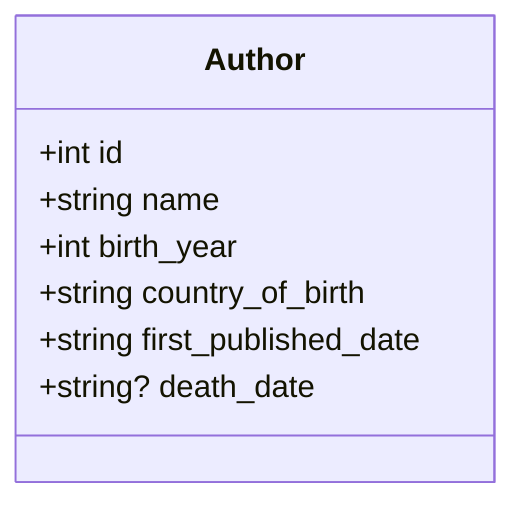

# PyRestAPIExamples
A simple FastAPI REST API server example. NO Database. Just a dictionary in memory for data.

## Description
This is a simple REST API for managing author information using FastAPI. The data is stored in-memory using a Python dictionary and is loaded at startup with six famous authors.

This also show how to create a virtual environment for python. 
PLUS, it gives you the chance to run the fastapi server in one vscode terminal and the `curl` client testing in a second terminal!!

_(just add a second terminal and click between them!)_


_(see the plus `+` sign, to create another terminal!)_


## Installation

1. Clone the repository:
```bash
git clone https://github.com/kristofer/PyRestAPIExamples.git
cd PyRestAPIExamples
```

2. Create venv & Install dependencies:
```bash
# you may have to install python 3.13
# use `brew install python@3.13`
python3.13 -m venv venv
source ./venv/bin/activate
pip install -r requirements.txt
```

## Running the Server

Start the FastAPI server with:
```bash
uvicorn main:app --reload
```

The server will be available at `http://localhost:8000`

## API Endpoints

### GET /
Root endpoint with API information.

### GET /authors
Get all authors.

**Example:**
```bash
curl http://localhost:8000/authors
```

### GET /author/{id}
Get a specific author by ID.

**Example:**
```bash
curl http://localhost:8000/author/1
```

### POST /author
Create a new author.

**Example:**
```bash
curl -X POST http://localhost:8000/author \
  -H "Content-Type: application/json" \
  -d '{
    "id": 7,
    "name": "George Orwell",
    "birth_year": 1903,
    "country_of_birth": "India",
    "first_published_date": "1933",
    "death_date": "1950"
  }'
```

## Initial Authors

The API is preloaded with the following authors:

1. J.R.R. Tolkien (1892-1973) - South Africa
2. Ernest Hemingway (1899-1961) - United States
3. F. Scott Fitzgerald (1896-1940) - United States
4. Willa Cather (1873-1947) - United States
5. Joan Didion (1934-2021) - United States
6. Thomas Wolfe (1900-1938) - United States

## Author Model

Each author has the following fields:
- `id` (integer): Unique identifier
- `name` (string): Full name
- `birth_year` (integer): Year of birth
- `country_of_birth` (string): Country of birth
- `first_published_date` (string): Date of first published book
- `death_date` (string, optional): Death date if applicable

### Class Diagram




## Testing Examples

Here are comprehensive curl examples to test the API:

### 1. Check API Root
```bash
curl http://localhost:8000/
```

### 2. Get All Authors
```bash
curl http://localhost:8000/authors
```

### 3. Get Specific Author (Tolkien)
```bash
curl http://localhost:8000/author/1
```

### 4. Get Another Author (Hemingway)
```bash
curl http://localhost:8000/author/2
```

### 5. Create a New Author (George Orwell)
```bash
curl -X POST http://localhost:8000/author \
  -H "Content-Type: application/json" \
  -d '{
    "id": 7,
    "name": "George Orwell",
    "birth_year": 1903,
    "country_of_birth": "India",
    "first_published_date": "1933",
    "death_date": "1950"
  }'
```

### 6. Create Another Author (Virginia Woolf)
```bash
curl -X POST http://localhost:8000/author \
  -H "Content-Type: application/json" \
  -d '{
    "id": 8,
    "name": "Virginia Woolf",
    "birth_year": 1882,
    "country_of_birth": "United Kingdom",
    "first_published_date": "1915",
    "death_date": "1941"
  }'
```

### 7. Test Error - Get Non-existent Author
```bash
curl http://localhost:8000/author/999
```

### 8. Test Error - Create Duplicate ID
```bash
curl -X POST http://localhost:8000/author \
  -H "Content-Type: application/json" \
  -d '{
    "id": 1,
    "name": "Test Author",
    "birth_year": 2000,
    "country_of_birth": "Test",
    "first_published_date": "2020",
    "death_date": null
  }'
```

### 9. Verify New Author Was Created
```bash
curl http://localhost:8000/author/7
```

## Interactive API Documentation

FastAPI automatically generates interactive API documentation:
- Swagger UI: http://localhost:8000/docs
_(you can use the `/docs` page of fastapi to run REST API test urls too!)_
